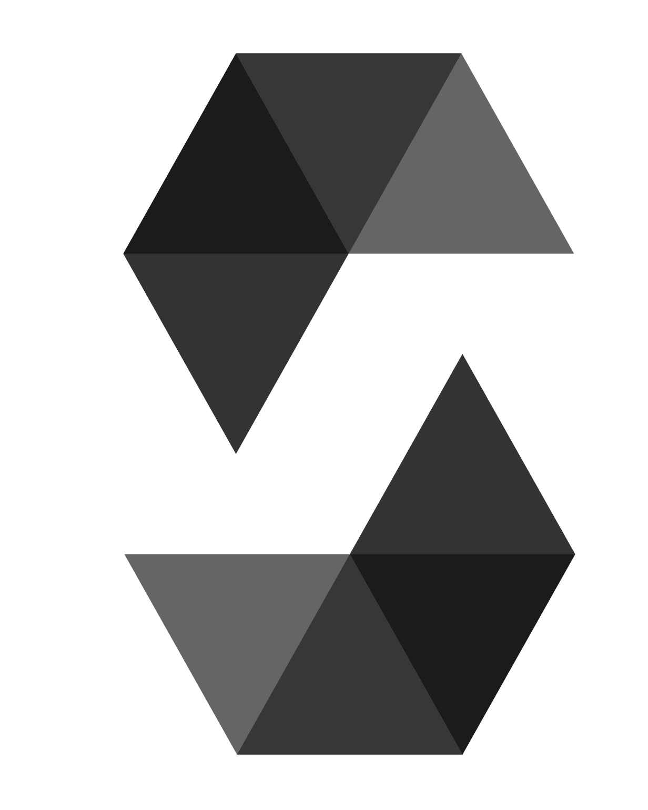

# Hi there, Gulam Rasul Shah - aka [LammyRu][youtube] 👋 

- 🔭 I’m currently working as Blockchain Engineer, Backend Developer & Polygon developer support
- 👀 I’m interested in Web3, Blockchain, FPS Gaming, NFT Game, Decentralised Finance, DApp etc
- 🌱 I’m currently expanding my skills as a Blockchain DApp Developer and Backend developer
- 👯 I’m looking to collaborate on Decentralised Web3 projects and Backend projects.
- 🥅 2023 Goals: Learn more about web3, Blockchain and decentralisation
- 💬 approach me regarding web3, blockchain & decentralization :)
- ⚡ Fun fact: I enjoy anime & online FPS games :)
- 🤔 Working on improving Frontend??? (maybe xD)
- 📫 Email: grspro98@gmail.com

### Connect with me:

&nbsp;&nbsp;

&nbsp;&nbsp;

&nbsp;&nbsp;

### Languages and Tools:

 
 

  
:zap: GitHub Stats
  

[youtube]: https://youtube.com/lammyru 
