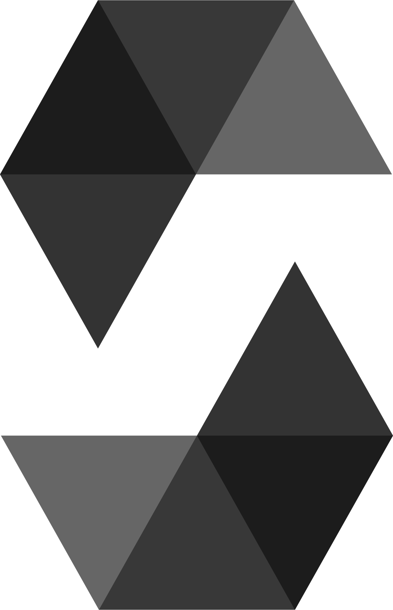
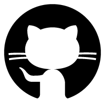
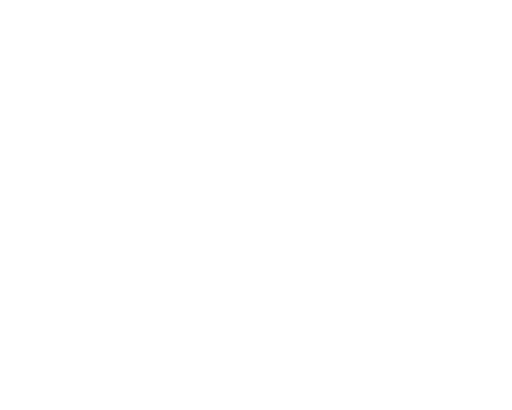

# Hi there, Gulam Rasul Shah - aka [LammyRu][youtube] 👋 

- 👀 I’m interested in Blockchain, Web3, Ethereuem, NFT Game, DeFi, DApp etc
- 🔭 I’m currently working on Blockchain and DApp
- 👯 I’m looking to collaborate on Web3 Projects
- 🌱 I’m currently learning the skills to become a Full stack DApp Developer
- 🥅 2022 Goals: Learn more about web3
- 🤔 Hate Frontend, working on it to improve
- 💬 Ask me about anything
- 📫 Email: grspro98@gmail.com
- ⚡ Fun fact: I watch anime and i game alot :)

### Connect with me:

&nbsp;&nbsp;

&nbsp;&nbsp;

&nbsp;&nbsp;

### Languages and Tools:

 
 

  
:zap: GitHub Stats
  

[youtube]: https://youtube.com/lammyru 
